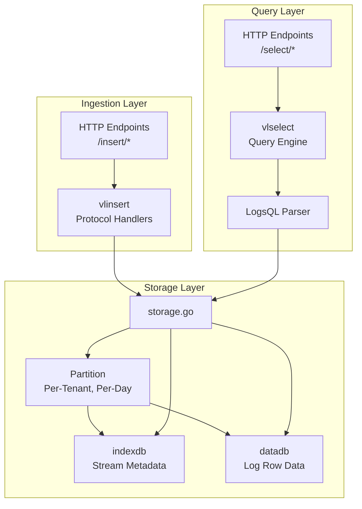
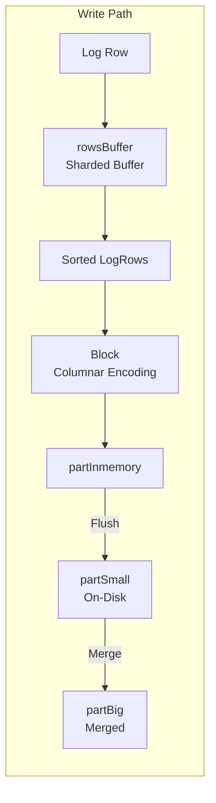
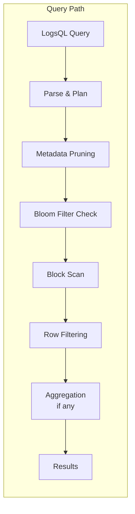

# VictoriaLogs Architecture Scaffold

## High-Level Architecture

## Data Flow: Write Path

## Data Flow: Query Path

## Key Components Reference

| Component | Source File | Responsibility |
|-----------|-------------|----------------|
| storage | `lib/logstorage/storage.go` | Top-level coordinator, partition management |
| partition | `lib/logstorage/partition.go` | Per-tenant, per-day data container |
| indexdb | `lib/logstorage/indexdb.go` | Stream ID and tag indexing |
| datadb | `lib/logstorage/datadb.go` | Log row storage, parts, merges |
| block | `lib/logstorage/block.go` | Columnar block encoding |
| bloomfilter | `lib/logstorage/bloomfilter.go` | Probabilistic skip indexing |

## Your Task

As you progress through levels, annotate this diagram with:
1. Specific function names at each transition
2. Key invariants at each boundary
3. Performance bottlenecks you discover
