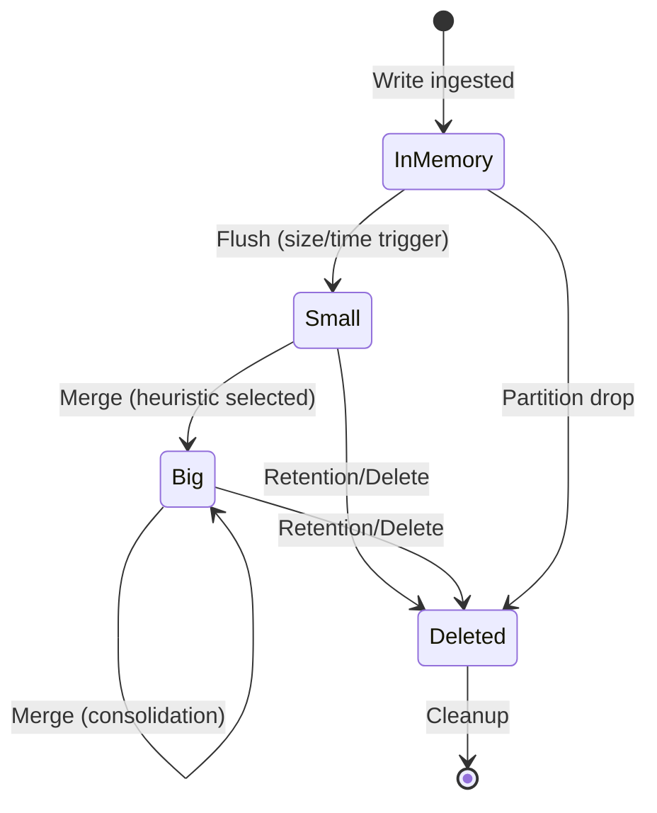
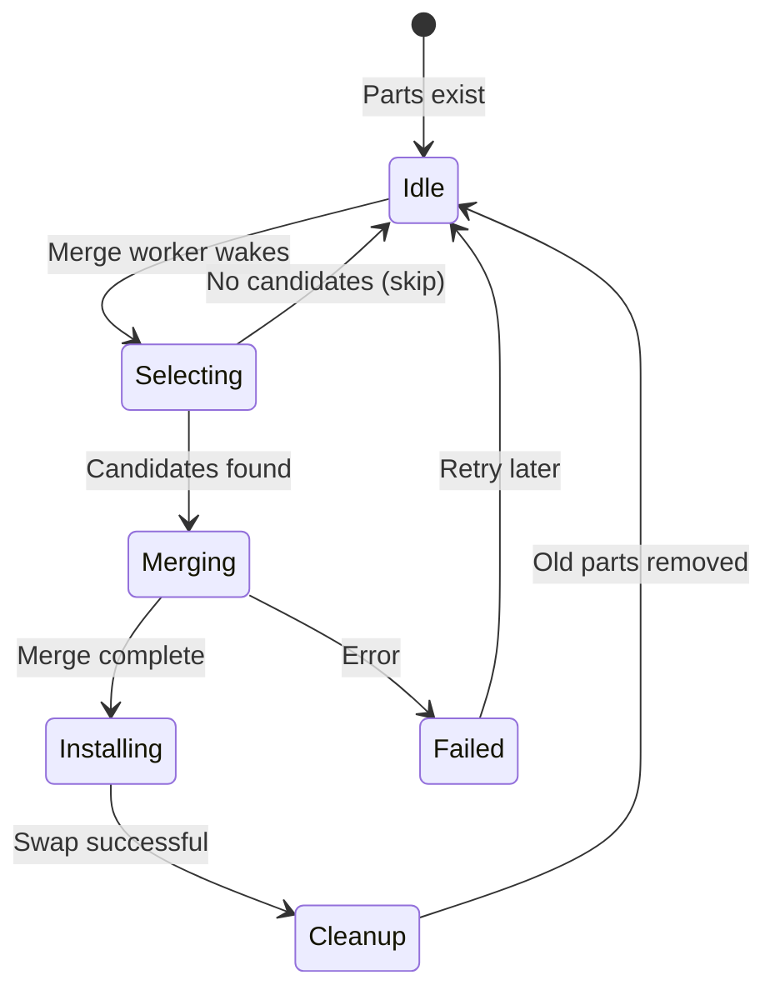
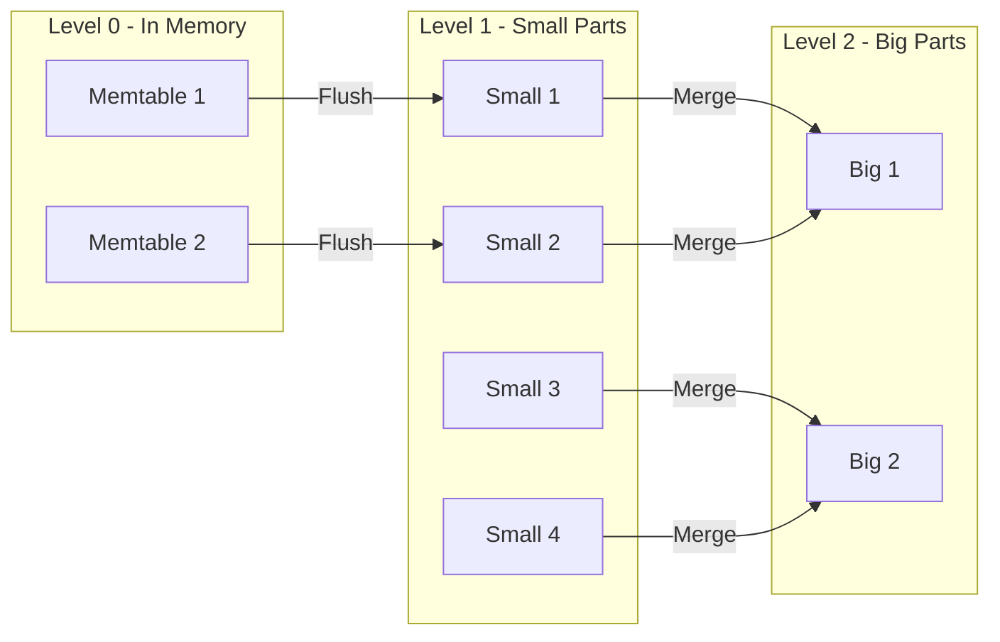

# LSM State Diagram

## Part Lifecycle (VictoriaLogs Style)



## Merge State Machine



## Write Amplification Visualization



## Key State Invariants

| State | Invariant |
|-------|-----------|
| InMemory | Mutable until frozen for flush |
| Small | Immutable, may overlap with other Small |
| Big | Immutable, non-overlapping time ranges (after merge) |
| Merging | Source parts remain readable until swap |
| Installing | Atomic swap: readers see old OR new, never mixed |

## Merge Candidate Selection Logic

```
for each part p in sorted-by-size:
    find overlapping parts with p
    if total_size >= minMergeMultiplier * p.size:
        add to candidates
    if enough candidates:
        return candidates
return none (skip merge)
```

## Your Task

As you implement Level 5 phases:
1. Add state transition triggers (what causes each arrow?)
2. Document failure modes at each state
3. Identify where backpressure applies
