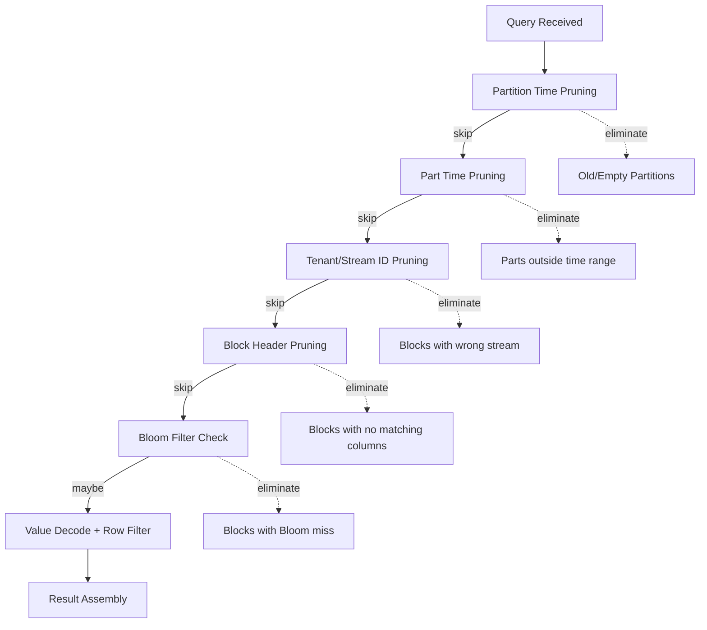
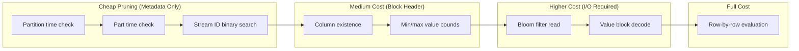
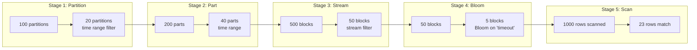

# Query Pruning Pipeline

## Pipeline Overview



## Pruning Cost vs Benefit



## Bloom Filter Decision Tree

```mermaid
flowchart TD
    START[Need to filter column?] --> CONST{Const column?}
    CONST --> |Yes| FAST[Use const value<br/>O(1) check]
    CONST --> |No| DICT{Dict encoded?}
    DICT --> |Yes| LOOKUP[Dict lookup<br/>O(1) check]
    DICT --> |No| BLOOM{Bloom available?}
    BLOOM --> |No| SCAN[Full value scan]
    BLOOM --> |Yes| CHECK{Bloom check}
    CHECK --> |false| SKIP[Skip block<br/>Guaranteed no match]
    CHECK --> |true| VERIFY[Decode & verify<br/>May have false positive]
    VERIFY --> MATCH{Match found?}
    MATCH --> |Yes| INCLUDE[Include in results]
    MATCH --> |No| EXCLUDE[Exclude row]
```

## Pruning Statistics to Track

| Stage | Metric | Formula |
|-------|--------|---------|
| Partition | `partitions_scanned / partitions_total` | Lower = better |
| Part | `parts_scanned / parts_total` | Lower = better |
| Block Header | `blocks_after_header / blocks_before_header` | Reduction ratio |
| Bloom | `blocks_after_bloom / blocks_before_bloom` | Reduction ratio |
| Bloom FP | `false_positives / bloom_matches` | Should be < 10% |
| Final | `rows_returned / rows_scanned` | Selectivity |

## Example: Query `_stream:*error*` AND `message:*timeout*`



## Your Task

As you trace queries in Level 8:
1. Fill in actual numbers for a real query
2. Identify which stage provides most reduction
3. Propose an optimization if a stage is ineffective
